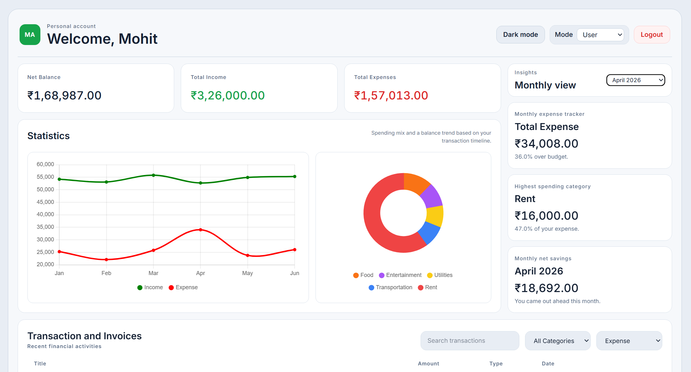
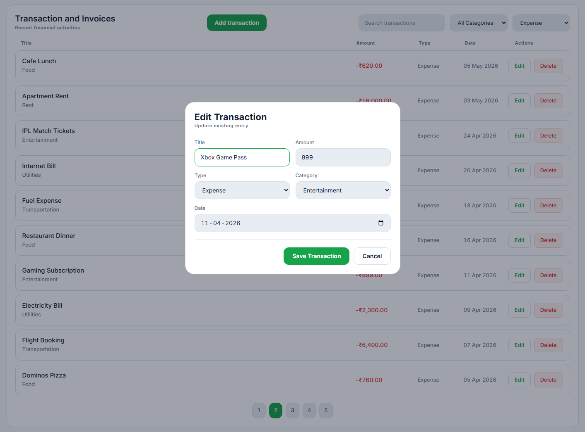
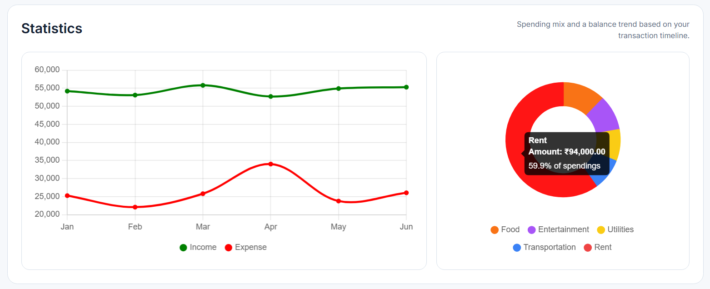

# FinMo

A responsive personal finance dashboard built for an internship assignment. The app helps users review income and expenses, inspect spending patterns through charts, track monthly limits, and manage transactions through a simple role-based interface.

## Deployed Build

Live Demo: https://finmo-beryl.vercel.app/

## Screenshots

### Dashboard Overview(User)



### Transaction Management(Admin)



### Charts



## Overview

This project is a frontend-only finance dashboard created with React and Vite. It ships with mock transaction data and stores user changes in the browser using `localStorage`, so the dashboard feels interactive without requiring a backend.

The interface is organized around a few core workflows:

- reviewing headline numbers like net balance, total income, and total expenses
- exploring monthly trends and category-wise spending with charts
- monitoring budget usage and monthly savings through quick insights
- searching, filtering, adding, editing, and deleting transactions
- switching between `user` and `admin` modes to change available actions

## Features

- Summary cards for net balance, total income, and total expenses
- Interactive charts powered by Chart.js for:
  - monthly income vs expense trends(Line Chart)
  - expense distribution by category(Doughnut/Pie Chart)
- Insights panel showing:
  - monthly expense tracker(configurable expense limit in Admin mode)
  - highest spending category for the selected month
  - monthly net savings
- Transaction list with filters for:
  - search by title
  - category
  - transaction type
- Admin-only transaction management:
  - add new transactions
  - edit existing transactions
  - delete transactions
  - update the expense limit(Insights section)
- User/Admin mode switcher to simulate different access levels
- Theme toggle with persisted light/dark preference
- Persistent state using `localStorage` for:
  - transactions
  - expense limit
  - selected theme
- Preloaded mock dataset covering multiple months for immediate charting and testing

## Tech Stack

| Layer               | Technology                          |
| ------------------- | ----------------------------------- |
| Frontend            | React                               |
| Build Tool          | Vite                                |
| Charts              | Chart.js, `react-chartjs-2`         |
| Styling             | Plain CSS                           |
| State & Persistence | React hooks, browser `localStorage` |

## Getting Started

### Prerequisites

Make sure the following are installed:

- Node.js `18+` recommended
- npm

### Installation

Clone the repository and install dependencies inside the frontend app:

```bash
git clone <your-repo-url>
cd finance-dashboard/frontend
npm install
```

### Running Locally

Start the development server:

```bash
npm run dev
```

Vite will print a local URL, usually:

```bash
http://localhost:5173
```

### Production Build

Create an optimized production build:

```bash
npm run build
```

## How It Works

The app loads a predefined mock transaction dataset on first launch. After that, any transactions you add or edit are stored in `localStorage`, allowing the dashboard to persist between refreshes in the same browser.

There is no backend or authentication layer in this version. The `user` and `admin` roles are UI modes meant to demonstrate permission-aware interactions:

- `user` can browse summaries, charts, insights, and transactions
- `admin` can additionally add, edit, delete transactions, and update the monthly expense limit

## Project Structure

```text
finance-dashboard/
\-- frontend/
    |-- index.html
    |-- package.json
    |-- vite.config.js
    \-- src/
        |-- App.jsx
        |-- main.jsx
        |-- App.css
        |-- index.css
        |-- data/
        |   \-- transactions.js
        |-- utils/
        |   |-- formatters.js
        |   \-- reducers.js
        |-- components/
        |   |-- AddTransactionModal/
        |   |-- RoleSwitcher/
        |   |-- SummaryCard/
        |   |-- Pagination/
        |   \-- TransactionItem/
        \-- sections/
            |-- ChartsSection/
            |-- InsightsSection/
            |-- SummarySection/
            \-- TransactionsSection/
```

## Notes

- Currency values are formatted in Indian Rupees (`INR`)
- The starter dataset includes historical mock transactions across several months
- Clearing browser storage will reset the app back to its initial mock data state

## Acknowledgements

Built as a part of an internship assignment.
